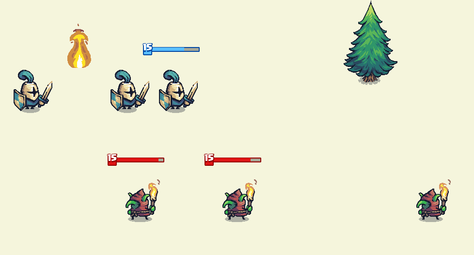

## Bloc Notes

# animations

dead 1
fire 1
warior 3  [idle run atack]
gobelin 3  [idle run atack]
rocks 4 
tree 1
foam 1

# pictures

gobelin house 1
gobelin house destroyed 1
knight house 1
knight house destroyed 1
bush 3 []
mushroom 3 []
water 1
grass 1

# Swords-Line

Pourquoi faire le Jeu Principal côté serveur ?

1. Anti-triche et sécurité : En ayant la logique du jeu sur le serveur, vous pouvez mieux contrôler et vérifier les actions des joueurs, minimisant ainsi les risques de triche et de manipulation du jeu.

2. Latence et synchronisation : En gérant la logique du jeu sur le serveur, vous pouvez garantir que tous les joueurs voient le même état du jeu, réduisant ainsi les problèmes de synchronisation et de latence.

3. Équilibrage : Vous pouvez apporter des ajustements et des modifications à la logique du jeu côté serveur sans nécessiter de mises à jour des clients, ce qui facilite l'équilibrage du jeu.

4. Compatibilité : Les clients peuvent être sur différentes plateformes ou versions, mais en conservant la logique du jeu côté serveur, vous évitez les problèmes de compatibilité entre les différentes versions de clients.

5. Économie de bande passante : Les clients n'ont besoin de transférer que les entrées des joueurs (ce qui nécessite moins de bande passante) plutôt que des informations détaillées sur l'état du jeu.

6. Simplicité du client : Les clients deviennent moins complexes car ils n'ont pas à gérer l'ensemble de la logique du jeu, ce qui peut faciliter le développement et la maintenance.